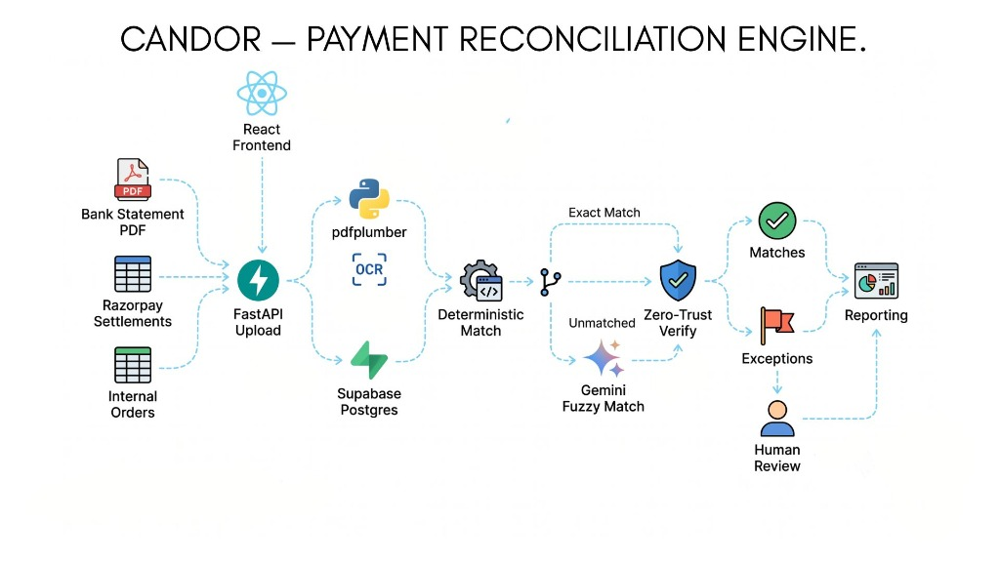

# Candor

**Deterministic payment reconciliation for Indian merchants.** Verify 3-way matching between bank statements, Razorpay payouts, and internal order ledgers.

A deterministic-first payment reconciliation agent for merchants — matches payment gateway settlements (Razorpay), bank statements, and internal merchant orders, producing an honest exception ledger for everything it couldn't confidently resolve.

  

Built for the **Razorpay AI Buildathon — Track 04: AI Finance Controller.**

---

## The Problem

A merchant's money lives in three places that never perfectly agree:

| Source | Format | Messiness |
|--------|--------|-----------|
| Razorpay settlement report | Structured CSV | Payout IDs, gateway fees, reference numbers |
| Bank statement | PDF (text layer or scanned) | Raw narration strings, mangled references, rounding |
| Internal orders / invoices | Structured CSV | Order IDs, amounts, customer records |

Reconciling these manually is slow and error-prone. Reconciling them with a naive LLM produces confident-sounding matches that are arithmetically wrong. Candor solves this with a **deterministic pass first**, LLM only for genuine ambiguity, and a **mandatory verification gate** before any AI-proposed match is accepted.

---

## Core Features

- **PDF bank statement ingestion** — text-layer extraction (primary) with Tesseract OCR fallback; rows extracted via OCR are flagged `low_ocr_confidence` and treated as inherently uncertain downstream
- **CSV settlements & orders ingestion** — parses payment gateway settlement reports and internal merchant order registers with flexible header mapping and ASCII INR amount normalization
- **Deterministic exact & subset-sum matching** — UTR pattern extraction, fee arithmetic verification, and subset-sum combinatorial matching for many-to-one settlements without LLM latency
- **LLM fuzzy-match pass** — Gemini function-calling at temperature 0; inspects unmatched transactions with explicit accounting reasoning
- **Verification gate** — independent deterministic check confirms cited IDs exist and amount arithmetic (`settlement.amount + settlement.fee == order.amount`) is valid within tolerance; failures route directly to the exception ledger
- **Tunable confidence threshold** — adjustable slider in the UI to shift items between matched and exception views
- **Continuous aging exception ledger** — tracks unresolved items with machine-readable reasons and human controls (accepted, rejected, unmatched) across batches
- **Live reporting** — match rate %, breakdown by match type, and pipeline processing time per batch

---

## Technology Stack

| Layer | Technology |
|-------|------------|
| Backend | Python · FastAPI |
| Database | Supabase (PostgreSQL) |
| LLM | Gemini (`gemini-3.6-flash`, temperature 0) |
| PDF / OCR | pdfplumber (text layer) · Tesseract (OCR fallback) |
| Frontend | React · Tailwind CSS |

---

## Architecture Overview



> **Key design principle:** deterministic code handles certainty; the LLM only handles genuine ambiguity — and even then, it is independently verified against database arithmetic before acceptance.

---

## Project Structure

```
Candor/
├── backend/                  # FastAPI application
│   ├── app/
│   │   ├── api/              # Route handlers
│   │   ├── core/             # Config, settings, Supabase client
│   │   ├── ingestion/        # PDF parsing, OCR fallback, CSV ingestors
│   │   ├── matching/         # Deterministic pass, fuzzy pass, verification gate
│   │   ├── exceptions/       # Exception ledger & aging logic
│   │   ├── reporting/        # Match rate, breakdown, timing
│   │   └── models/           # Pydantic schemas
│   ├── tests/
│   ├── requirements.txt
│   └── .env.example
├── frontend/                 # React application
│   ├── src/
│   │   ├── components/       # ConfidenceBadge, ReasoningBlock, MatchTypeTag
│   │   ├── screens/          # UploadScreen, ExceptionLedger, MatchedTransactions, LandingPage, LoginPage, HistoryView
│   │   └── api/              # API client (typed, with error states)
│   └── package.json
├── docs/                     # System & phase documentation
│   ├── architecture-diagram.png  # System architecture diagram (referenced above)
│   ├── OVERVIEW.md           # System overview & architecture index
│   ├── DOMAIN_NOTES.md       # Domain reconciliation notes
│   ├── SECURITY_NOTES.md     # Security & threat model
│   └── phase-*.md            # Detailed phase documentation
├── .env.example
├── .gitignore
└── README.md
```

---

## Prerequisites

- Python 3.11+
- Node.js 18+
- A Supabase project
- A Google AI / Gemini API key
- Tesseract OCR installed locally (optional fallback path)

---

## Environment Variables

Copy `.env.example` to `.env` in both the root directory and backend

```bash
# Frontend
VITE_API_BASE_URL=http://localhost:8000
```

---

## Running Locally

### Backend

```bash
cd backend
python -m venv .venv
source .venv/bin/activate        # Windows: .venv\Scripts\activate
pip install -r requirements.txt
uvicorn app.main:app --reload --port 8000
```

API documentation is available at http://localhost:8000/docs (Swagger UI).

### Frontend

```bash
cd frontend
npm install
npm run dev
```

Frontend UI is available at http://localhost:5173.

---

## Demo

Demo video:https://youtu.be/FGPnOwqr4A8


---

## Roadmap

- [ ] Multi-bank statement format support beyond initial parser set
- [ ] Merchant-facing notification on new exceptions
- [ ] Export exception ledger to CSV/Excel for accounting handoff
- [ ] Configurable per-merchant tolerance & matching rules

---

## License

MIT
